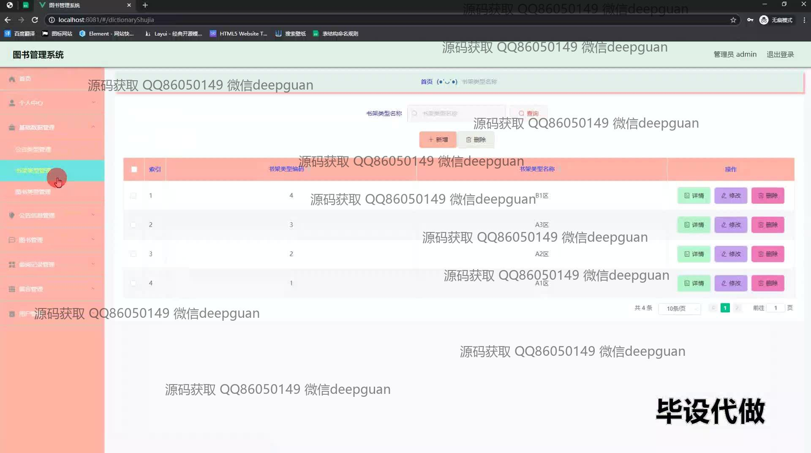
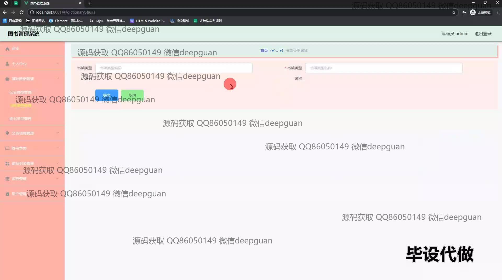
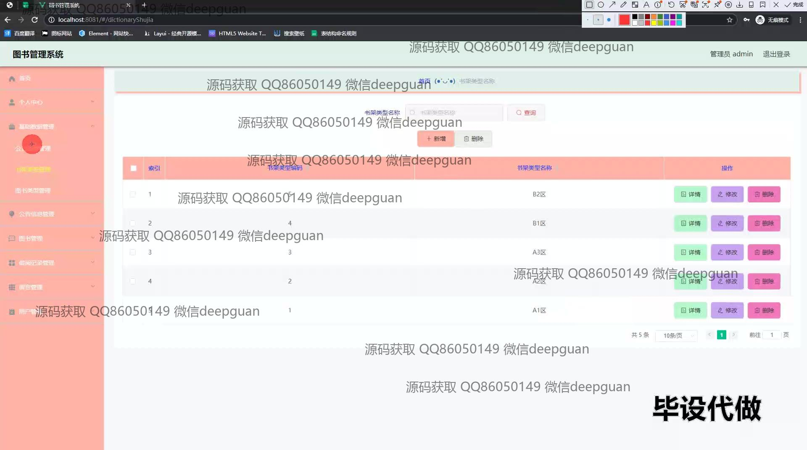
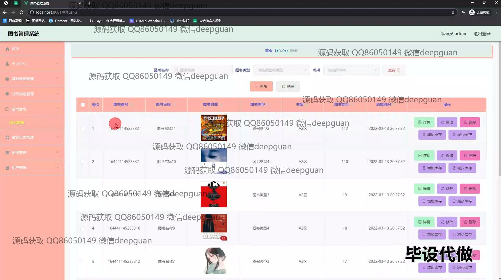
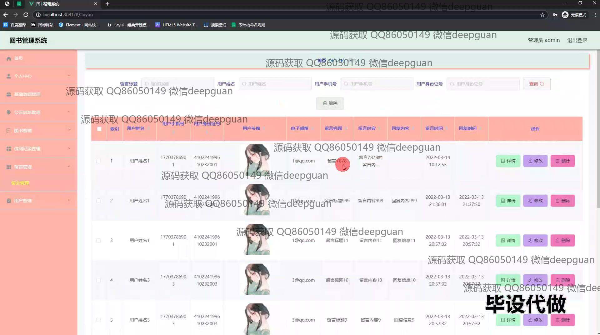
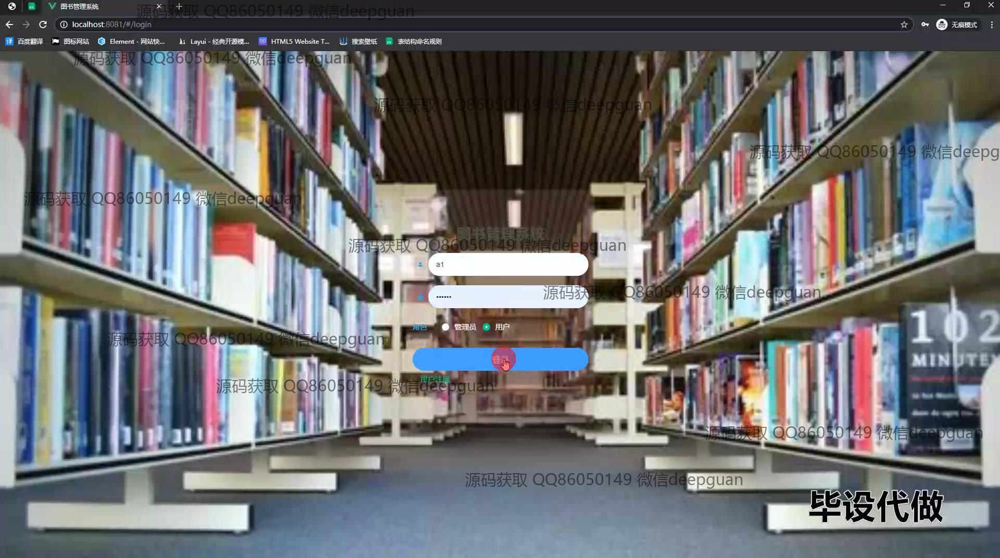
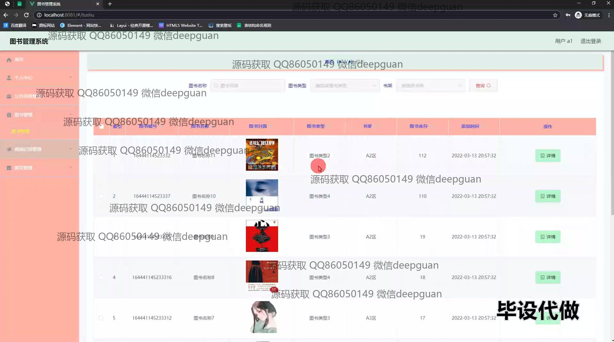
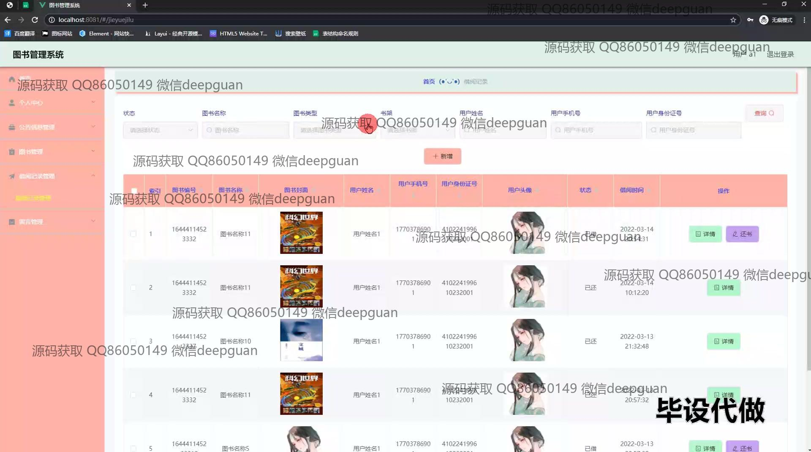
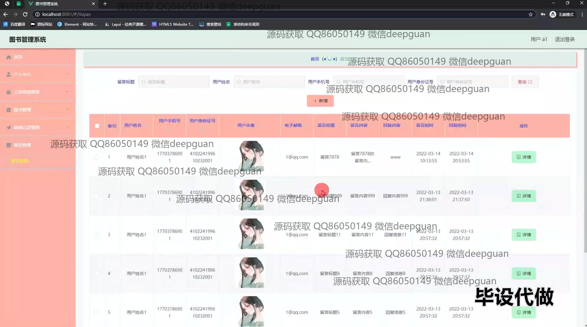
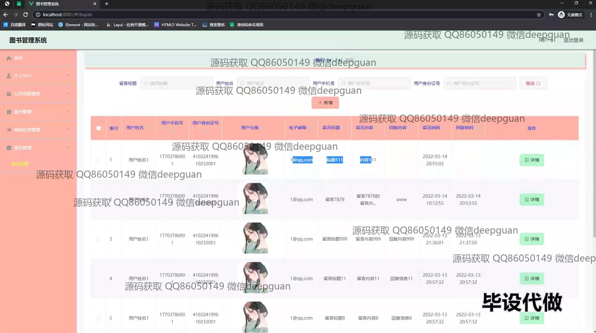

<h1 align="center">图书管理系统设计与实现+vue</h1>

## 简介
图书管理系统：角色分为管理员、用户；功能包括图书管理、书架管理、留言管理、借阅记录管理等，通过用户登录实现书籍信息查询和管理，界面简洁直观。    --计算机毕业设计源码；毕设源码；java毕业设计源码

## 联系方式

<h3 align="center">获取完整代码与数据库文件 + 微信：deepguan QQ: 86050149 QQ群: 783742310</h3>

<h3 align="center">可帮忙远程部署 包运行成功！提供远程部署、修改代码、设计文档指导、代码讲解等服务！</h3>

## 功能介绍（完整见运行截图）
管理员：该系统为管理员提供了全面的功能支持，包括管理员信息查看与编辑、注销、用户留言管理、公告管理、图书类型管理、图书信息管理、借阅记录管理以及用户管理功能。管理员可以通过导航菜单有效管理书架类型、增删改查书籍、处理用户留言、查看系统公告，并能够详细查看各类图书记录及用户借阅情况。此外，管理员有权限通过登录页面选择相应角色并进行身份验证，以便进入系统执行相应管理操作。 用户：用户权限涵盖登录、注销功能，通过个人中心进行信息查看与修改，能够浏览书籍分类信息，并在图书管理模块中查看与搜索图书详情。用户还可以查看属于自己的借阅记录，管理借阅状态，充分利用留言模块上传反馈信息。此外，系统提供便捷的留言管理功能，让用户能够通过简洁直观的界面高效查询和管理留言信息，确保无缝沟通和系统交互。

## 运行截图

本代码来源于网络,仅供学习参考使用!

